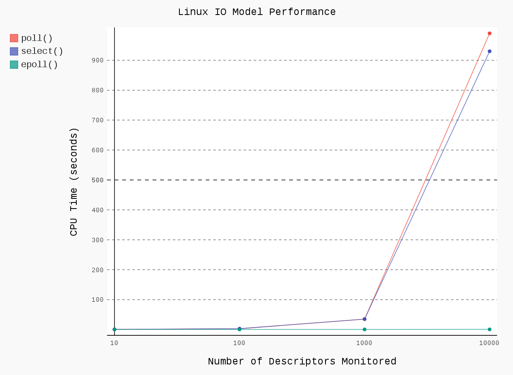

DVISUAL
=======

Personal data visualization.

Kevin Leptons <kevin.leptons@gmail.com> <br>
CC by 4.0 License <br>
June, 2017

FEATURES
========

- Quick access to Python data visualization APIs
- Pygal library



USAGE
=====

```bash
# tools
apt-get install git python3

# source code
git clone https://github.com/kevin-leptons/dvisual
cd dvisual

# virtual environment
./env init
. venv/bin/active
./env install

# show various data visualization in 'dvisual' directory
# it displays svg file in default browser
python dvisual/linux-io-model.py
```

REFERENCES
==========

- [Data Visualization](https://en.wikipedia.org/wiki/Data_visualization)
- [Pygal](http://pygal.org/en/stable/)
